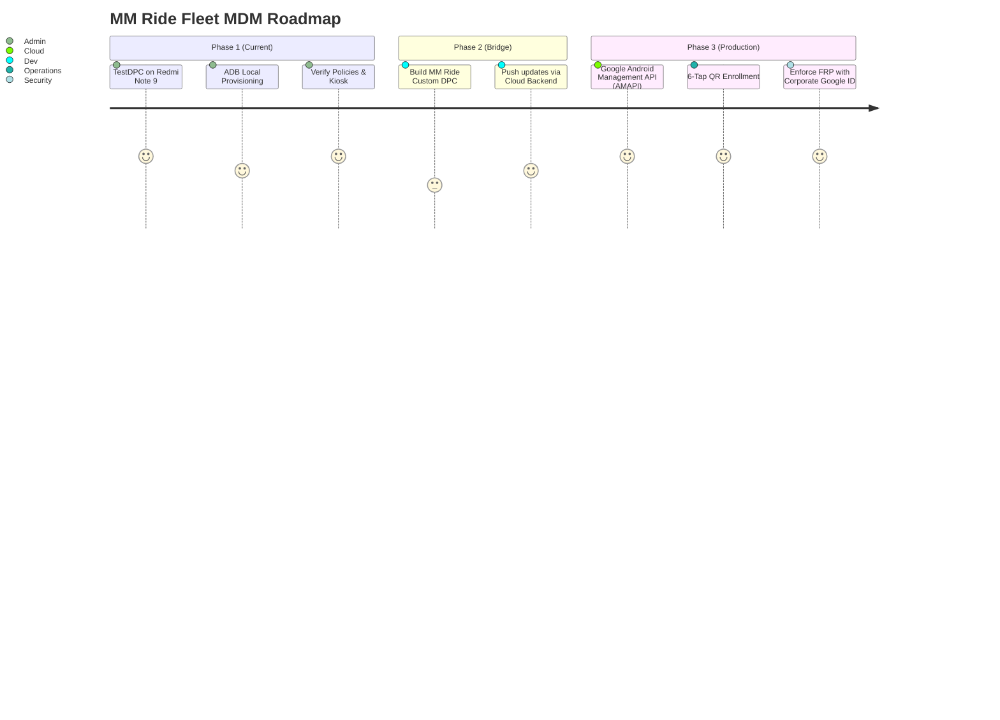

# 📘 MM Ride – Fleet Phone Management Guide (Redmi Note 9 / MIUI 14)

This operational manual documents the device management lifecycle for the **Redmi Note 9 (MIUI Global 14.0.3 Stable / Android 13)** company-owned driver fleet.

---

## 📑 Table of Contents
1. [Section A: Setup Instructions & Prerequisites](#section-a-setup-instructions--prerequisites)
2. [Section B: Windows ADB Tools & Environment](#section-b-windows-adb-tools--environment)
3. [Section C: Provisioning Procedures (Development vs Production)](#section-c-provisioning-procedures)
4. [Section D: Verification Procedure (Read-Only)](#section-d-verification-procedure)
5. [Section E: Troubleshooting & Safe Failure Resolution](#section-e-troubleshooting--safe-failure-resolution)
6. [Section F: Rollback & Deprovisioning Procedure](#section-f-rollback--deprovisioning-procedure)
7. [Section G: Production MDM Migration Plan](#section-g-production-mdm-migration-plan)
8. [Section H: Technical Limitations: Redmi Note 9 + MIUI 14 + Android 13](#section-h-technical-limitations)

---

## Section A: Setup Instructions & Prerequisites

### 1. Hardware Specification
* **Device**: Redmi Note 9 (Global)
* **ROM**: MIUI Global 14.0.3 Stable
* **Android Base**: Android 13 (API Level 33)
* **Status**: Company Asset (Dedicated Fleet Device - NOT a Personal Phone)

### 2. Pre-requisites on Phone
1. **Developer Options Activation**:
   * Open `Settings` -> `About Phone`.
   * Tap **MIUI Version** 7 times rapidly until the message *"You are now a developer!"* appears.
2. **Developer Settings Configuration**:
   * Go to `Settings` -> `Additional Settings` -> `Developer Options`.
   * Turn **ON** `USB Debugging`.
   * Turn **ON** `Install via USB` (requires Mi SIM or local bypass).
   * Turn **ON** `USB Debugging (Security settings)` (allows input simulation and permissions).
3. **Account Clearance (for Development ADB Method)**:
   * Open `Settings` -> `Accounts & Sync`.
   * Remove any Google, Mi, WhatsApp, or third-party accounts.
   * *Note: Android OS strictly forbids setting a Device Owner if any user account is present.*
4. **MIUI Dual Apps & Second Space Check**:
   * Verify `Settings -> Apps -> Dual apps` is **Disabled**.
   * Verify `Settings -> Special features -> Second space` is **Turned OFF**.

---

## Section B: Windows ADB Tools & Environment

All management scripts reside in `c:\MM Ride\mdm\`.

### File Inventory
* `inspect_device_preflight.bat`: **Read-Only** diagnostic tool. Checks hardware, Android version, accounts, and users without touching device state.
* `provision_fleet_phone.bat`: Safe **Development Provisioning Tool** (TestDPC). Includes non-destructive prerequisite checks.
* `verify_fleet_device.bat`: **Read-Only Verification Script**. Enforces strict `[PASS]`, `[FAIL]`, `[WARNING]` outputs based on `dumpsys device_policy`.
* `deprovision_fleet_phone.bat`: Deprovisioning script to return phone to unmanaged state when retired.
* `PRODUCTION_MDM_SPECIFICATION.md`: Architectural specification for the cloud-managed production DPC.

---

## Section C: Provisioning Procedures

### Method 1: Development / Testing Provisioning (No Factory Reset)
> ⚠️ **IMPORTANT**: This method uses `TestDPC` via USB ADB for fast developer testing. **It does NOT survive a hardware recovery factory reset.**

1. Connect the Redmi Note 9 to the Windows PC via USB cable.
2. Accept the **"Always allow from this computer"** RSA fingerprint prompt on the phone screen.
3. Run the pre-flight check to verify device state:
   ```cmd
   mdm\inspect_device_preflight.bat
   ```
4. If pre-flight reports `[STATUS] READY FOR PROVISIONING`, run:
   ```cmd
   mdm\provision_fleet_phone.bat
   ```
5. The script will:
   * Verify 0 accounts exist.
   * Verify single-user state (`User 0` only).
   * Install `TestDPC.apk`.
   * Enforce Device Owner: `adb shell dpm set-device-owner com.afwsamples.testdpc/.DeviceAdminReceiver`.
   * Automatically execute `verify_fleet_device.bat` to audit policy state.

---

### Method 2: Production Enrollment (Enterprise 6-Tap QR / Zero-Touch)
> ℹ️ For mass rollout of company-owned phones where management must persist across setup wizards:

1. Factory reset or unbox the Redmi Note 9.
2. On the initial **MIUI 14 Welcome screen**, tap the white space **6 times**.
3. Connect to Wi-Fi when prompted.
4. Scan the MM Ride Enterprise Enrollment QR code (pointing to Google CloudDPC or `com.mmride.dpc`).
5. Android provisions the DPC into the protected system container before any user account can be added.

---

## Section D: Verification Procedure (Read-Only)

To verify the device at any time without modifying settings:

```cmd
mdm\verify_fleet_device.bat
```

### Verification Criteria
1. **Device Owner Confirmation**:
   * Scans `adb shell dumpsys device_policy` for:
     `Device Owner: ComponentInfo{...admin=...}`
   * **Only prints `[PASS] DEVICE OWNER ACTIVE` if explicitly confirmed in the system policy dump.**
2. **User Profiles**: Confirms only `UserInfo{0:...}` exists.
3. **Core Subsystems**: Confirms `com.android.phone`, `com.google.android.gms`, and WebView are active.
4. **Location**: Confirms High Accuracy (Mode 3) is active.
5. **Driver App**: Confirms `com.mmride.driver` is present.

---

## Section E: Troubleshooting & Safe Failure Resolution

| Symptom / Error | Root Cause | Safe Resolution (No Data Loss) |
|---|---|---|
| `IllegalStateException: Not allowed to set device owner because accounts exist` | A Google, Mi, or messaging account is signed in. | Go to `Settings -> Accounts & Sync` and tap **Remove Account** on each listed account. Do NOT wipe user files. Re-run script. |
| `java.lang.IllegalStateException: UserInfo{10:...} exists` | MIUI Second Space is active. | Open `Settings -> Special features -> Second space` and choose **Delete Second space**. |
| `java.lang.IllegalStateException: UserInfo{999:...} exists` | MIUI Dual Apps created a secondary user. | Go to `Settings -> Apps -> Dual apps` -> Settings icon -> **Delete dual apps account**. |
| `INSTALL_FAILED_USER_RESTRICTED` | MIUI blocks installing APKs via USB. | Go to `Settings -> Developer Options` -> Toggle **Install via USB** to ON. |
| `device unauthorized` | PC is not trusted. | Reconnect USB cable; unlock phone; check **Always allow**; tap **OK**. |

---

## Section F: Rollback & Deprovisioning Procedure

When a phone is being reassigned, sold, or taken out of fleet service:

1. Connect the phone via USB with USB Debugging enabled.
2. Double-click:
   ```cmd
   mdm\deprovision_fleet_phone.bat
   ```
3. Or manually run in terminal:
   ```bash
   adb shell dpm remove-active-admin com.afwsamples.testdpc/.DeviceAdminReceiver
   ```
4. The phone immediately revokes Device Owner status, disables kiosk lockdown, and restores standard Android consumer settings.

---

## Section G: Production MDM Migration Plan



### Transition Steps
1. **Replace TestDPC with CloudDPC / Custom DPC**:
   * Migrate policy JSON to Google Android Management API (AMAPI) or custom `com.mmride.dpc`.
2. **Private App Hosting**:
   * Publish `com.mmride.driver` to Managed Google Play Private Apps or distribute via MDM CDN.
3. **Automate Zero-Touch / QR Generation**:
   * Generate encrypted enrollment QR codes from the MM Ride Admin Web dashboard.

---

## Section H: Technical Limitations: Redmi Note 9 + MIUI 14 + Android 13

Be aware of physical and operating system limitations that cannot be overridden by software:

1. **Physical Recovery Button Wipe (Mi-Recovery)**:
   * A driver can power off the phone, hold `Power + Volume Up`, and access **Mi-Recovery** to wipe user data.
   * **Mitigation**: Software MDM cannot disable hardware buttons on Redmi Note 9. However, **Android Factory Reset Protection (FRP)** must be enforced via DPC. If wiped, the phone is permanently locked to the company's Google Account and cannot be used by the driver or third party.
2. **Bootloader & Rooting**:
   * The bootloader must **REMAIN LOCKED**.
   * Unlocking the bootloader breaks SafetyNet / Play Integrity, invalidates Knox/hardware keystore protections, and introduces security vulnerabilities.
3. **MIUI Battery Optimization**:
   * MIUI aggressively kills background GPS services. For `com.mmride.driver`, battery saver must be manually or programmatically set to **"No restrictions"**.
4. **USB Debugging in Production**:
   * In a finished production deployment, USB Debugging **must be disabled** (`DISALLOW_DEBUGGING_FEATURES`) to prevent drivers from using ADB to bypass app controls.
